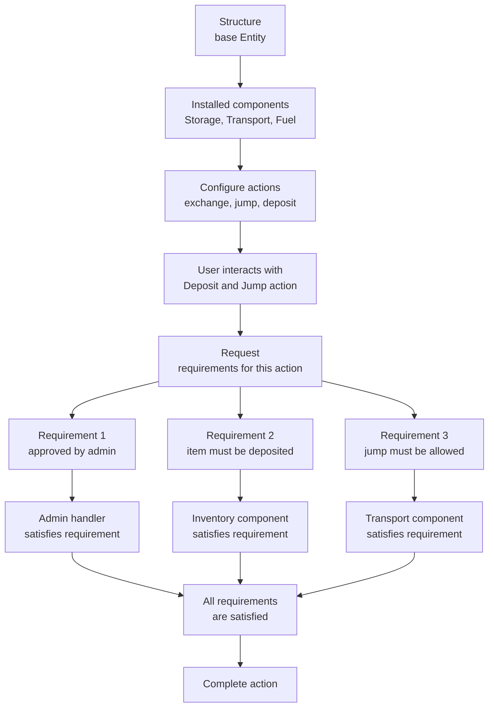
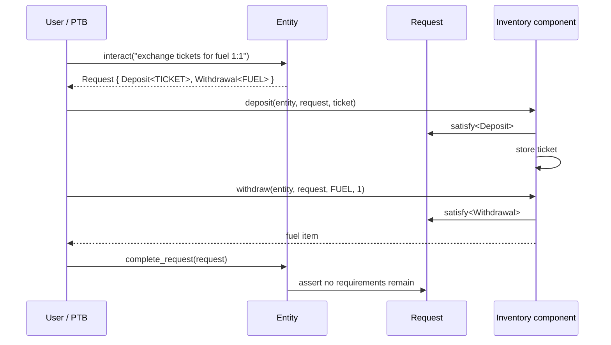

# 2. Modular Architecture

- **Status:** Accepted — implemented in `contracts/core/`
- **Supersedes:** [0001-assembly-architecture](0001-assembly-architecture.md)
- **See also:** [`CONTEXT.md`](../../CONTEXT.md) (domain glossary, Entity / Component map),
  [`docs/move-conventions.md`](../move-conventions.md) (coding conventions)

## Motivation

The current production `world` design is assembly-first. Each structure type, such as a gate or storage unit, owns its object shape and exposes a fixed set of APIs.

That model is simple to integrate, but it does not fit the next modular building direction well:

1. **Upgrades are painful** because behavior is encoded in predefined object layouts. Once a Sui object type is published, changing stored fields usually means introducing a new type and migrating state.
2. **New game behavior often requires core changes** because rules are attached to specific assembly functions instead of a shared programmable action model.
3. **Composition is limited** because programmability is restrictive and not generalized across actions.

The goal of the new architecture is to keep the base structure small, install behavior through components, and make behavior programmable through on-chain requirements.

### Modular Building

We want to support modular buildings in the game:

1. Create a base structure.
2. Install components that provide behavior, such as storage, transport, fuel, power, or weapons (game modules).
3. Expose programmable actions that compose those component behaviors.
4. Attach rules to those actions so game design can evolve without changing the base structure type.

Example:

A player owns a structure and installs a storage component (a game module) on it. Later, they configure that structure to offer an exchange: give one ticket and receive one fuel item.

How Entity, Component, and game-module wording fit together: [`CONTEXT.md`](../../CONTEXT.md).

## Decision

Introduce a modular architecture built around five concepts:

- `Entity`: the base shared object representing a structure (or character).
- `Component<T>`: typed state installed on an entity (Identity, Inventory, …).
- `Action`: a named programmable behavior exposed by an entity.
- `Request`: a hot-potato value created when an action starts.
- `Requirement`: a typed rule that must be satisfied before the request can complete.

The key design shift is:

| Current model | New model |
| --- | --- |
| A concrete assembly type owns behavior, such as `gate::jump` or `storage_unit::deposit`. | A base `Entity` owns installed components and exposes named actions. |
| Rules are encoded inside assembly functions. | Rules are represented as `Requirement` values attached to actions. |
| Adding behavior often means changing core assembly code. | Adding behavior usually means installing a component, adding a handler, or exposing a new action. |
| Clients integrate with assembly-specific APIs. | Clients inspect an action, satisfy its requirements, and complete the request. |

## Architecture Overview



At a high level:

1. Admin or owner creates an `Entity`.
2. Admin-approved components are installed on the entity.
3. Owner exposes named actions, each with an ordered list of requirements.
4. A user interacts with an action, which creates a `Request`.
5. The PTB satisfies each requirement by calling the right handler.
6. The entity completes the request only when no requirements remain.

## Core Concepts

### Entity

`Entity` is the base structure object. It stays small and stores extension data through dynamic fields.

Conceptually:

```move
public struct Entity has key {
    id: UID,
    version: u64,
    // dynamic field: ActionsKey() => VecMap<String, Action>
    // dynamic field: ComponentKey(u64) => Component<T>
}
```

This means adding a new component does not require adding a new field to the base entity type.

### Component

`Component<T>` wraps typed state installed on an entity. A game module (player
fitting) is one kind of component. Identity is a component and is not a fitting.

Examples:

- `Component<Identity>`
- `Component<Inventory>`
- `Component<Transport>`
- `Component<Fuel>`
- `Component<PowerGen>`

The component is stored under a caller-supplied `u64` slot (`component_id`).
Well-known singletons hash a name to that id:

```text
ComponentKey(id_from_name("identity")) => Component<Identity>
ComponentKey(storage_01)               => Component<Inventory>
ComponentKey(transport)                => Component<Transport>
```

Requirements can target a component by id, so the same entity can host multiple
components of the same type if needed.

### Action

An `Action` is a named list of requirements.

Examples:

- `deposit to SU-01`
- `withdraw from SU-01`
- `exchange tickets for fuel 1:1`
- `jump through gate`

Conceptually:

```move
public struct Action has drop, store {
    /// Requirements are stored in reverse of declaration order.
    requirements: vector<Requirement>,
    version: u64,
}

public fun new(mut requirements: vector<Requirement>): Action {
    requirements.reverse(); // store reversed so pop_back yields declaration order
    Action { requirements, version: VERSION }
}
```

The action does not execute logic by itself. It creates a request that must be satisfied by component or service calls.

### Request

`Request` is the transaction-scoped checklist for one action.

```move
public struct Request {
    structure_id: Option<ID>,
    requires: vector<Requirement>,
}
```

`Request` intentionally has no abilities. It cannot be stored, copied, or dropped. Once created, the transaction must satisfy it and complete it.

### Requirement

`Requirement` is a typed rule instance.

```move
public struct Requirement has drop, store {
    type_name: TypeName,
    component_id: Option<u64>,
    data: vector<u8>,
}
```

Each requirement contains:

- `type_name`: identifies which handler is allowed to satisfy it, such as `inventory::Deposit`.
- `component_id`: optionally targets an installed component slot.
- `data`: BCS-encoded configuration, such as item type and min/max quantity.

Example requirement constructor:

```move
public fun deposit_requirement(component_id: u64, rule: ItemRequirement): Requirement {
    requirement::from_config(
        option::some(component_id),
        Deposit(rule),
    )
}
```

The config is stored as bytes, but the type identity is still `Deposit`. This lets the handler prove it is satisfying the correct rule.

## Request + Requirement Flow

The important invariant is simple:

```text
An action can complete only when every requirement has been satisfied.
```

The request API is:

```move
// Pop the next requirement, proving the caller owns type `T` via a Permit.
// Returns the requirement plus a Frame the handler can push follow-ups into.
public fun take_next<T>(request: &mut Request, _: internal::Permit<T>): (Requirement, Frame) {
    let next = request.requires.pop_back();
    assert!(next.is<T>(), 0);
    (next, Frame { pending: vector[] })
}

// Push any newly-spawned requirements back onto the request.
public fun enqueue(request: &mut Request, frame: Frame) { /* ... */ }

public(package) fun complete(request: Request) {
    let Request { requires, .. } = request;
    assert!(requires.length() == 0);
}
```

Handlers call `take_next<T>` (aliased as `satisfy<T>`) with the type they own. The `Permit<T>` is package-private, so only the module that defines `T` can satisfy a requirement of that type.

The handler does three things:

1. Borrows the targeted component through the active request.
2. Satisfies the next typed requirement.
3. Enforces the requirement data before mutating state.

The returned `Frame` lets a handler push **new** requirements onto the same request before continuing — this is how dynamic, in-transaction follow-ups are modeled (the handler `enqueue`s the frame when done).

#### Component targeting (`component_id` enforcement)

`take_next<T>` only checks the requirement *type*. Component *identity* is enforced when the handler borrows the component. `component_mut` reads the component id off the **next requirement**, not off the handler's own arguments:

```move
public fun component_mut<T: store>(e: &mut Entity, req: &Request, _: internal::Permit<T>): &mut Component<T> {
    assert!(req.entity_id().is_some_and!(|id| id == e.id.to_inner()));
    // id comes from the requirement, so the handler can't hit the wrong component
    let component_id = req.next().component_id().destroy_or!(abort ERequirementNotComponentScoped);
    df::borrow_mut(&mut e.id, ComponentKey(component_id))
}
```

So a requirement scoped to storage slot `(02)` forces the handler onto that component; it can never accidentally mutate `(01)`. The `component_id` field is `Option` only for requirements that don't target a component (e.g. an admin/sponsor approval); component handlers `abort` when it is `None`.

## Use Case: Exchange Tickets For Fuel

Setup:

1. Install an `Inventory` component named `storage unit (01)`.
2. Expose an action named `exchange tickets for fuel 1:1`.
3. The action has two requirements:
   - `Deposit(ItemRequirement { type_id: TICKET, quantity: 1 })`
   - `Withdrawal(ItemRequirement { type_id: FUEL, quantity: 1 })`



```move
// 1. Install inventory behavior.
let mut request = entity.install("storage unit (01)", inventory::new(ctx), ctx);
admin_acl::approve_install<inventory::Inventory>(&admin, &mut request, ctx);
entity.complete_request(request);

// 2. Expose a programmable action.
let request = entity.expose(
    "exchange tickets for fuel 1:1",
    action::new(vector[
        inventory::deposit_requirement(
            "storage unit (01)",
            option::some(TICKET_TYPE_ID),
            option::some(1),
            option::some(1),
        ),
        inventory::withdraw_requirement(
            "storage unit (01)",
            option::some(FUEL_TYPE_ID),
            option::some(1),
            option::some(1),
        ),
    ]),
    ctx,
);
entity.complete_request(request);

// 3. Execute the action.
let mut request = entity.interact("exchange tickets for fuel 1:1", ctx);
inventory::deposit(&mut entity, &mut request, item::new(TICKET_TYPE_ID, 1, ctx));
let fuel = inventory::withdraw(&mut entity, &mut request, FUEL_TYPE_ID, 1, ctx);
entity.complete_request(request);
```

## Client And PTB Discovery

The trade-off of programmable actions is that the client must know how to satisfy requirements.

The intended pattern is:

1. Client calls or inspects an action and sees its requirements.
2. Each requirement type maps to a PTB template or handler.
3. The client builds a PTB that calls the handlers in order.
4. The final call completes the request.

Example mapping:

```text
inventory::Deposit      -> inventory::deposit_template / inventory::deposit
inventory::Withdrawal   -> inventory::withdraw_template / inventory::withdraw
```

Example PTB template for client discovery:

```move
public fun deposit_template(
    req: &Requirement,
    ptb: &mut ptb::Transaction,
    mut args: vector<ptb::Argument>,
): vector<ptb::Argument> {
    ptb.command(
        ptb::move_call(
            "mvr:@frontier/inventory",
            "inventory",
            "deposit",
            vector[tx::entity(), tx::request(), args.pop_back()],
            vector[],
        ),
    );

    vector[]
}
```

This keeps Move contracts authoritative while letting SDKs automate transaction construction.

## Upgrade And Lifecycle Strategy

The new design does not rely on one upgrade mechanism. It gives us several options depending on the change.

For additive changes:

- Add a new requirement type or handler.
- Expose new actions that include the requirement.
- Existing entity and component layouts can stay unchanged.

For bug fixes:

- Upgrade the package if the function body can change safely.
- Add version checks when old behavior must be blocked.
- Disable or remove stale actions if they should no longer be used.

For stored layout/interface changes:

- Introduce `InventoryV2` or another new component type.
- Install the V2 component.
- Migrate known state from V1 to V2.
- Deprecate the old component slot.
- Remove stale actions that point at V1 requirements.

Lifecycle APIs support this:

```move
entity::disable_action(&mut entity, &admin_acl, action_name, ctx); // reversible soft block
entity::remove_action(&mut entity, &admin_acl, action_name, ctx);  // hard delete stale action data
entity::deprecate_component(&mut entity, &admin_acl, component_id, ctx);
```

## Consequences

What becomes easier:

- **Upgrades**: core entity logic and component behavior are decoupled, so new components, new rules, and V2 component migrations do not always require changing the base structure.
- **Reusability**: independent checks such as admin approval, sponsor approval, item deposit, fuel burn, and proximity proof can be combined across actions.
- **New component support**: new behavior can be added as a component instead of creating a new assembly type.
- **Programmability**: all programmable actions use the same request and requirement flow.

What becomes harder:

- PTB construction must understand requirement order and handler discovery.
- Requirement data must be carefully designed because it is stored as BCS bytes.
- Component ids become part of action configuration, so slot identity and owner/admin controls matter.

The main trade-off is intentional: complexity moves out of predefined assembly modules and into explicit action configuration, request construction, and requirement satisfaction.
