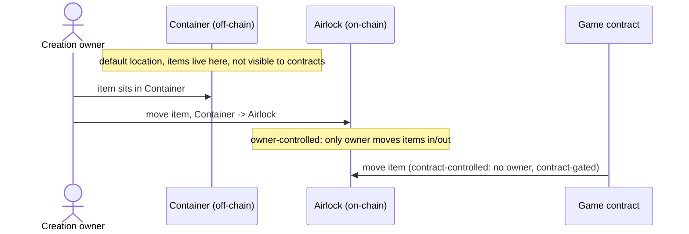
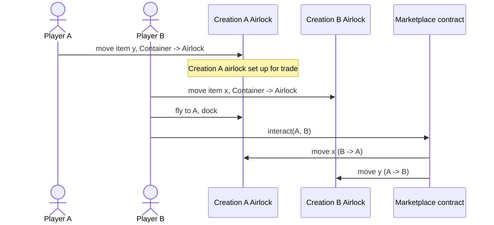

# 3. On-Chain Inventory: Airlock Model

- **Status:** Proposed
- **Relates to:** [0002-modular-architecture](0002-modular-architecture.md),
  `contracts/inventory` module

## Motivation

The current `contracts/inventory` module gives every entity a `main` inventory
(owner-controlled, created at install) and lazily creates an `ephemeral`
inventory per non-owner caller. Ephemeral exists as a stop-gap: player ships
have no on-chain inventory today, so a caller interacting with someone else's
entity needs *somewhere* to put items.

This has two problems:

1. Ephemeral conflates two different needs - personal staging space for a
   caller with nowhere else to hold items, and neutral escrow for a trade -
   under one mechanism. Neither is a clean fit.
2. A ship's actual contents are never represented on-chain, so no contract can
   verify or gate on what a ship is carrying.

Design notes propose a general model instead: every creation (ship or
structure) gets its own on-chain inventory. This ADR adapts that model to the
existing Entity/Module/Action/Request architecture and proposes retiring
`ephemeral` inventories.

## Decision

Split each creation's inventory into two tiers:

- **Container** : in-game, off-chain, lives in the monolith. Default location
  for items. Not visible to contracts.
- **Airlock** : on-chain inventory, one per creation, including ships.
  Capacity is game-configured. Items become chain-verifiable only once moved
  from Container to Airlock.

An Airlock's ownership is configurable per creation:

- **Owner-controlled** : only the creation's owner moves items in/out. This is
  today's `main` inventory, unchanged.
- **Contract-controlled** : a shared inventory with no owner; only a specific
  contract (e.g. a marketplace) can move items through it. This replaces the
  "personal ephemeral bucket per caller" pattern with genuine neutral escrow.
  Here the access control needs to be transferred to the contract from the owner.

`ephemeral` inventories are removed entirely. There is no more free,
anonymous per-caller storage. Every creation that wants to interact
on-chain, including a player's own ship, needs its own real Airlock.

### Architecture

### Rollout: two iterations

**Iteration 1 : explicit, player-initiated**

1. Player moves items from Container to Airlock.
2. Airlock now holds an on-chain balance for the contract to enable on-chain use cases.
3. Player interacts (trade, deposit, collect) via the existing
   Action/Request/Requirement flow against the Airlock.

**Iteration 2 : lazy, interaction-triggered**

1. Airlock starts empty.
2. Player starts an interaction; the chain emits an event on what items are needed for the use case.
3. The needed item then moves from Container to Airlock, then the interaction executes.

Benefit of iteration 2: a player never pre-commits items on-chain unless a
trade is actually happening.

### Example: marketplace trade

This mirrors how SSU trading works today; the difference is the ephemeral
bucket is gone and replaced by the player's own ship Airlock.

### Ship-internal movement

The "intra-ship inventory" note abstracts Container-to-Container movement
within a ship, based on game rules and conduits. That movement is out of
scope for these contracts; it is noted here for context only.

## Consequences

- No more free ephemeral storage. Non-owners lose the "drop items into
  someone else's entity for free" convenience; a ship needs its own real
  Airlock and capacity to participate in any on-chain interaction.
- Airlock capacity must account for shared, multi-party use (trade, pooling),
  not just an owner's private capacity. A contract-controlled Airlock
  handling many trades may need to be sized larger than an owner-only one.
- The existing bridge functions (`game_item_to_chain_inventory`,
  `chain_item_to_game_inventory`) already match the notes' "interim chain
  solution" (monolith owns movement, chain gets events/actions). They become
  the Container, Airlock bridge rather than being replaced.

## Open Questions

- **Iteration 2 atomicity** : is "trigger event -> item appears on-chain ->
  interact" one PTB, or two separate transactions? If two, what happens if a
  player never completes the second step?
- **Capacity model** : is Airlock capacity always per-creation, or does a
  contract-controlled Airlock need a cap independent of the owner's own
  capacity?

Feedback welcome via issues/PR comments on this ADR.
