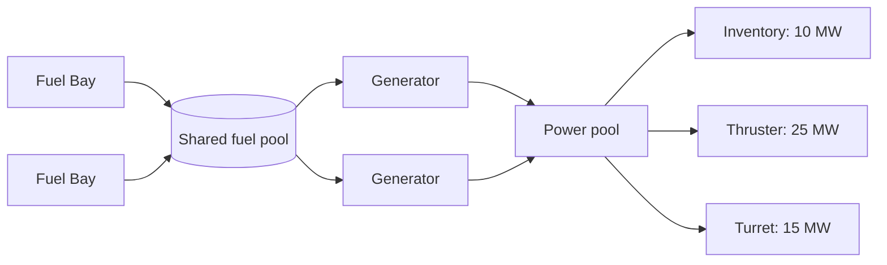
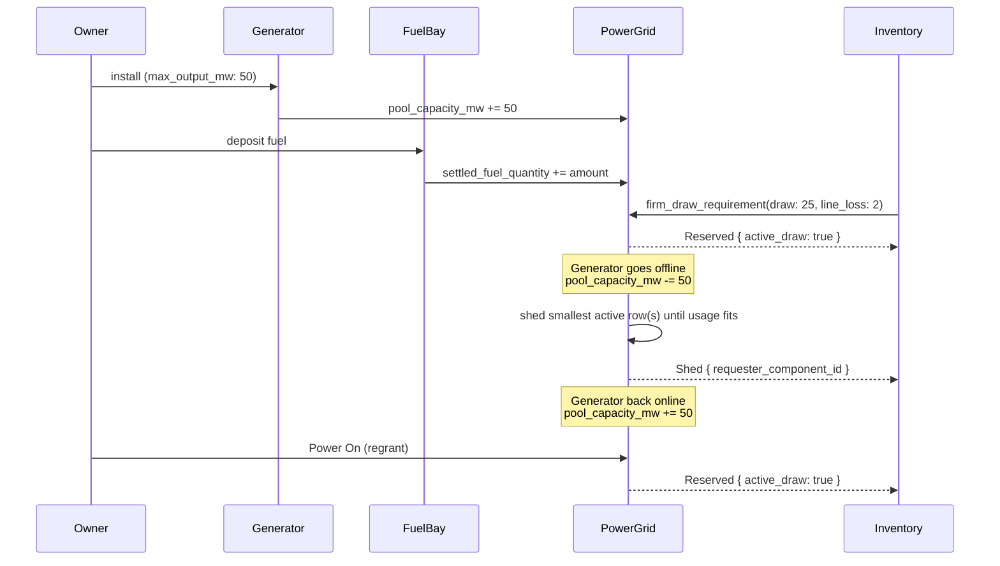

# 4. On-Chain Power Network

- **Status:** Proposed

## Motivation

A Creation (ship, structure, anything a player builds) has to manage power: fit
generators, burn fuel, and make sure every module that needs power actually
gets it. Today that bookkeeping only happens inside the game client. Moving it
on-chain enables builders to:

- Automate power management across modules through contracts, instead of only
through the game client.
- Make fuel choice a real economic decision: track what is actually spent and
let better fuel last longer.
- Budget fittings arithmetically against a known power ceiling, instead of
guessing.
- Shut modules down in a priority order when power runs short.
- Let a tribe assign power-management actions to different members through contract-level
permissions.

This ADR covers a deliberately small v1: enough on-chain state and rules to
support power management, not a full port of the game client's power system (batteries,
burst weapon draw and multi-ship power sharing. See [Scope](#scope)).

## Summary

A creation can have a power grid to manage the power its modules need.

- **Generators** burn fuel and produce power (MW). Fit more generators, the
power grid's capacity goes up.
- **Fuel Bays** hold the fuel that generators burn, pooled together.
- Every other fitting that needs power (inventory, thruster, anything) is a
load on the grid. Switching it on asks for a fixed number of
megawatts.



When a connected module requests power, the grid remembers that request and
sets its `active_draw` to `true` if there was enough spare capacity to grant
it, or `false` if there wasn't. A request is never dropped, only left waiting.

When capacity shrinks a generator goes offline or Power turns Off the
grid switches off active modules, smallest draw first, until usage fits.
Switched-off modules stay known to the grid, waiting for capacity to
return.

Fuel running low is different: it depletes gradually, so nothing switches off
the moment it hits zero. Affected modules stay on until the grid is next
mutated by a transaction, or by a client reading the live view. There is no
on-chain settle or cron. However the game client updates its state based on a
off-chain timer. Any other builder logic based on the current value 
should read state through the view functions instead of assuming a cron
exists.

When capacity returns fitting a new generator, a refuel, or Power turning
back On, the grid loops through the connected modules in that same
transaction, and turns each one back on if it now fits.

Power On/Off is one master switch for the whole Creation. Off treats capacity
as zero and switches off every active module; the stored generator totals and
fuel stays the same.

**Not covered in v1:** no battery/capacitor buffering a shortfall, no burst power for weapon fire. See [Scope](#scope) and [Consequences](#consequences).

### End-to-end flow



A firm draw is a `Requirement` any consuming action can bundle in, satisfied
against the shared `PowerGrid` component or requested directly, without
bundling, via `PowerGrid`'s own standalone "request power" Action:

```move
public fun firm_draw_requirement(component_id: u64, draw: u64, line_loss: u64): Requirement;

// Bundled: Inventory's own "online" action carries the power requirement.
let req = request.satisfy<power_grid::FirmDraw>(permit);
power_grid::reserve(&mut grid, &mut request, req);

// Standalone: PowerGrid's own action.
power_grid::request_power(&mut grid, component_id, draw, line_loss, ctx);
```

## Scope

**In scope for v1:**

- One `Component<PowerGrid>` per Creation, tracking a pooled power ceiling
and current usage.
- One or more `Component<Generator>` fittings, each contributing a rated output
to the pool.
- One or more `Component<FuelBay>` fittings, all pooling into one shared fuel
supply (quantity + blended `impulse`) that every installed Generator burns
from.
- **Firm** power reservations only: a fixed draw, admitted all-or-nothing,
parked inactive if it does not fit, held until released or shed.
- Power On/Off (a Creation-level gate).
- Lazy (pull-based, no cron) fuel burn settlement.

**Out of scope for v1:**

- **Capacitor/Store on-chain entirely.** No stored battery charge, no Elastic
requests, no Burst requests, no reserve supply. If a capacitor exists in the
client, it is off-chain state only.
- Cross-Creation power sharing (Links/couplers).
- Builder-customizable shed priority.

## On-chain design

### Data model

#### `Component<PowerGrid>`

```move
public struct PowerGrid has store {
    on: bool,

    // pooled fuel, settled as of last_settled_ms, not live
    settled_fuel_quantity: u64,     // fuel remaining as of the last settlement
    fuel_capacity: u64,             // sum of installed Fuel Bays' rated capacity
    fuel_impulse: u64,              // blended (weighted-average) quality attribute

    // running-total ceilings (summed from online contributions)
    pool_capacity_mw: u64,          // sum of online Generators' rated max_output
    used_mw: u64,                   // sum of active_draw reservations (draw + line_loss)
    containment_reduction: u64,     // one Grid-level constant, shared by every Generator

    last_settled_ms: u64,           // timestamp settled_fuel_quantity was last computed at

    connected: VecSet<u64>,         // component_ids connected via a conduit
    reservations: LinkedTable<u64, FirmReservation>, // key = requester_component_id
}

public struct FirmReservation has store, drop {
    requester_component_id: u64,
    draw: u64,
    line_loss: u64,
    priority: u64,   // flat default for every reservation in v1
    active_draw: bool,
}
```

`LinkedTable` is keyed by `requester_component_id` so Reserve/Release are O(1).
Shed still scans every row with `active_draw` set and repeatedly picks the
smallest `draw + line_loss`

#### `Component<Generator>` (one or more per Creation)

```move
public struct Generator has store {
    max_output_mw: u64,
    // other generator attributes
}
```

#### `Component<FuelBay>` (one or more per Creation)

```move
public struct FuelBay has store {
    capacity: u64,
    // other fuel bay attributes
}
```

Deposit blends into the pooled `settled_fuel_quantity` / `fuel_impulse` on
`PowerGrid`, using the weighted-average formula
(`new_value = (old_value * old_qty + type_value * amount_added) / (old_qty + amount_added)`),
at 4 decimal fixed point (`SCALE = 10_000`).

#### Consuming modules (Inventory, Thruster, any future fitting)

Each carries its own `line_loss: u64` (set at install) and is added to
`PowerGrid.connected` at install time. No new component type is needed purely
to draw power: any existing or future component can include a
`power_grid::firm_draw_requirement(...)` in one of its own actions.

### Actions & Requirements

- **Power On / Power Off**: its own Action on the Power Grid, gated
`owner_requirement()`.
- **Firm draw**: a Requirement, bundled into the player's own action (e.g. a
Inventory's "online" action), or `PowerGrid`'s standalone **"request power"**
Action for a module.
- **Release**: a Requirement/handler pair on the player's own action (e.g.
"offline"), or directly via `power_grid`'s own action, by
`component_id`.
- **Generator install/online/offline**: on `Component<Generator>`'s own action,
pushes the `max_output_mw` delta into `PowerGrid.pool_capacity_mw`
(requires bundling a `power_grid` targeting requirement, since it mutates
a sibling component).
- **Fuel Bay install/uninstall/deposit**: pushes capacity deltas and
blends deposits into the pooled fuel state.
- **Rewire**: an owner-gated action to add/remove a component from
`PowerGrid.connected` after install.

### Events

- `Reserved { requester_component_id, draw, line_loss, active_draw }`
- `Released { requester_component_id }`
- `Shed { requester_component_id }`
- `PowerToggled { on }`
- `FuelAdded { fuel_type, amount, resulting_impulse }`

// More events can be added 

### Client & PTB discovery

`PowerGrid` needs plain view functions so a client or indexer can read
current state without waiting for a transaction to update the State:

- projected fuel quantity and properties at current time
- projected pool status at current time to return pool capacitoy, 
 used capacity and active reservations

Views are truth for fuel and effective capacity. Stored `active_draw` /
`used_mw` / `Shed` events lag until the next mutating action. There is no
`settle()` or poke action. Builders that rely on on-chain events should use
the view functions to compute the values for the side-effects.

## Consequences

**Easier:** builders can automate power management from on-chain state (effective
capacity, stored reservations, projected fuel) without querying the game
client.

**Harder / deferred:** no capacitor-backed grace period on-chain (a module
either has power or it does not, the instant fuel or capacity runs out). 

## Open questions carried forward

- Regrant order and Shed order
