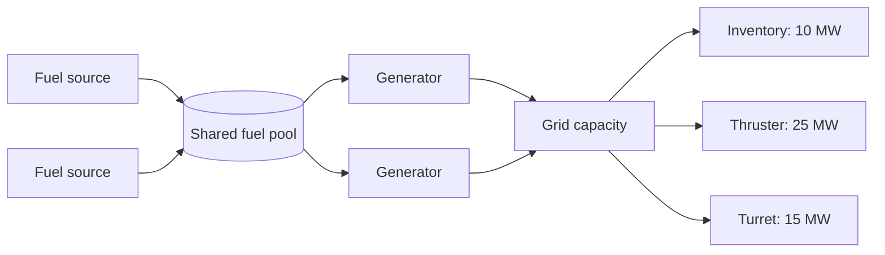
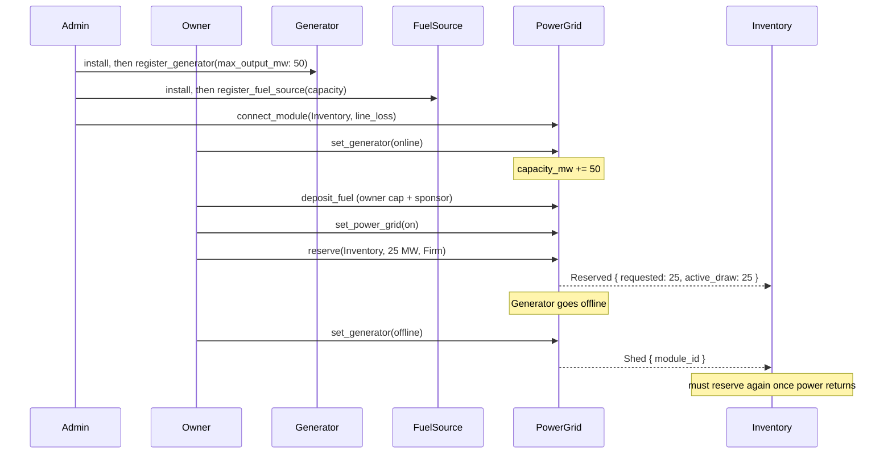

# 5. On-Chain Power Grid

- **Status:** Proposed

## Motivation

A Creation (ship, structure, anything a player builds) has to manage power: fit
generators, burn fuel, and make sure every module that needs power actually
gets it. Today that bookkeeping only happens inside the game client. Moving it
on-chain lets builders:

- Automate power management through contracts, not only through the game client.
- Make fuel choice a real economic decision: track what is spent and let better fuel last longer.
- Budget fittings against a known power ceiling.
- Shut modules down by priority group when power runs short.
- Let a tribe assign power actions to members through contract-level permissions.

This ADR covers a deliberately small v1. It does not port the game client's full
power system (batteries, burst weapon draw, multi-ship sharing). See [Scope](#scope).

## Summary

Each Creation has one power grid (`PowerGrid`). The grid pools generator output
and fuel, and grants power to connected modules.

- **Generators** are admin-registered with a rated output (MW), a containment
reduction and a base fuel rate. The owner brings them online or offline. Online
generators add their output to the grid's capacity.
- **Fuel sources** hold fuel for the grid. Their capacity is registered by an
admin. Fuel is pooled into one supply, with a blended impulse and containment
burden.
- **Modules** (inventory, thruster, any future fitting) are connected by an admin
with a line loss. The owner then reserves power for a module as **Firm**
(all-or-nothing) or **Elastic** (takes what is left).
- Fuel burns over time, lazily. Every mutating transaction settles the burn since
the last one.
- When effective capacity falls below what is in use, the grid sheds reservations
by **priority group**. Shed modules must reserve again. Nothing regrants them.




### Reservations

A module's reservation holds `requested` MW and `active_draw` MW granted now.
Line loss is charged on top while the reservation is held.

- **Firm:** `reserve` aborts unless `requested + line_loss` fits the leftover
capacity. A held Firm reservation always has `active_draw == requested`.
- **Elastic:** grants `min(requested, leftover - line_loss)`. `reserve` aborts only
if leftover does not cover the line loss.


There is no waiting state. A reservation is either held with a nonzero grant, or
absent. A module that cannot get power gets an abort at `reserve`, and the owner
retries later.

`used_mw` is the sum of `active_draw + line_loss` over held reservations. A module
is powered iff it holds a reservation.

### Shedding

Shedding runs after any change that lowers effective capacity: a generator goes
offline, the grid goes off, or the fuel runs out. Changing a module's priority
does not shed; the next capacity drop applies the new order.

- If effective capacity is `0` (grid off, or no fuel), every reservation is
released.
- Otherwise, while `used_mw > effective capacity`, every reservation in the
**highest priority group** that holds one is released. Group 0 is shed last.

Shedding drops whole reservations. It never shrinks an Elastic grant. Shed
modules get a `Shed` event and must reserve again. Nothing regrants them, and
their reservation is not restored when capacity returns.

### Fuel burn

Fuel burns lazily. Each mutating handler settles the burn since `last_settled_ms`
before it changes state. Views project the burn to the current time.

Each online Generator burns its share of the load:

- `load = min(used_mw, capacity_mw)`
- `fuel_factor = clamp(impulse / max(1, burden / containment_reduction), 1, 100)`,
all at `SCALE`
- `burn = ceil(load * max_output_mw * SCALE * elapsed_ms / (capacity_mw * fuel_factor * 1000))`

A Generator with zero impulse has no fuel factor. It burns `base_fuel_rate` per
second instead, rounded up.

Total burn is capped at the fuel left. When the fuel reaches zero, the grid emits
`FuelDepleted` and sheds every reservation.

### End-to-end flow




## Scope

**In v1:**

- One `PowerGrid` per Creation, with pooled capacity, fuel, and the module and
generator registries.
- `Generator` and `Fuel` markers, one or more per Creation. Their stats live in the grid.
- Firm and Elastic reservations, up to `MAX_CONNECTED` (100) modules.
- Owner-set priority groups, with whole-group shedding.
- Power On/Off as a Creation-level master switch.
- Lazy fuel burn, depletion, and owner-set rules on what fuel may be deposited.

**Out of v1:**

- Batteries, capacitors and burst draw. If a capacitor exists in the client, it is off-chain state only.
- Cross-Creation power sharing (links and couplers).
- Regranting shed modules when capacity returns.
- Partial shedding (shrinking an Elastic grant).


## On-chain design


### Data model

```move
public struct PowerGrid has store {
    on: bool,
    settled_fuel_quantity: u64,     // fuel as of last_settled_ms, not live
    fuel_capacity: u64,             // sum of registered fuel sources
    fuel_impulse: u64,              // blended impulse
    fuel_containment_burden: u64,   // blended burden
    capacity_mw: u64,               // sum of online generators' max_output_mw
    used_mw: u64,                   // sum of held (active_draw + line_loss)
    last_settled_ms: u64,
    modules: VecMap<u64, ModuleState>,       // connected modules, by component id
    generators: VecMap<u64, GeneratorState>, // registered generators
    fuel_sources: VecMap<u64, u64>,          // registered fuel sources and capacity
}

public struct GeneratorState has copy, drop, store {
    max_output_mw: u64,
    containment_reduction: u64,
    base_fuel_rate: u64,
    online: bool,
}

public struct ModuleState has copy, drop, store {
    line_loss: u64,
    priority: u64,                  // higher is shed first; 0 is last
    reservation: Option<Reservation>,
}

public struct Reservation has copy, drop, store {
    requested: u64,
    active_draw: u64,
    kind: DrawKind,                 // Firm | Elastic
}
```

Effective capacity is `capacity_mw` while the grid is on and fuel is above zero,
and `0` otherwise.

All MW, fuel and fuel-stat values are fixed point at `SCALE = 10_000` (4 decimals).

### Actions and authorization


| Operation                                                                                   | Gate                                                                     |
| ------------------------------------------------------------------------------------------- | ------------------------------------------------------------------------ |
| Install grid, generator or fuel marker                                                      | Admin                                                                    |
| `register_generator`, `unregister_generator` (must be offline)                              | Admin                                                                    |
| `uninstall_generator`, `uninstall_fuel_source` (must be unregistered)                       | Admin                                                                    |
| `register_fuel_source`, `unregister_fuel_source` (must still fit settled fuel)              | Admin                                                                    |
| `connect_module`, `disconnect_module` (disconnect releases any reservation)                 | Admin                                                                    |
| `set_power_grid`, `set_generator`, `set_priority`, `reserve`, `release`, `release_priority` | Owner `AccessCap` + operate-grid requirement                             |
| `deposit_fuel`                                                                              | Owner `AccessCap` (enforced in the handler) + admin-approved gas sponsor |


`deposit_fuel` checks the owner's `FuelRequirement` (fuel types, minimum impulse,
maximum containment burden, minimum and maximum amount). It then blends the
deposit into the pool by weighted average: `new = (old × old_qty + added × added_qty) / (old_qty + added_qty)`.
It aborts if the pool would exceed `fuel_capacity`.

Uninstalling a module's component is done by the module's own package, not by
power. Inventory calls `grid_load::assert_disconnected` before `uninstall`. This
aborts while the module is connected. A module package with no grid on the
entity is unaffected.

### Requirements (for composing actions)

- `power_grid::operate_grid_requirement()`: satisfied by owner operations on the grid.
- `power_grid::reserve_requirement(module_id, draw, kind)`: asserts the module
holds a reservation of at least `draw`, of the given kind. The consuming action
calls `assert_reserved`, which settles first and aborts if the fuel has run out.
- `power_grid::power_grid_requirement(...)`, `generator_requirement(...)`,
`deposit_fuel_requirement(...)`: owner-configured checks on grid state, generator
state and deposits.


### Events

- `PowerGridInstalled`, `PowerGridUninstalled`, `PowerToggled`, `CapacityChanged`
- `GeneratorRegistered`, `GeneratorUnregistered`, `GeneratorToggled`
- `FuelSourceRegistered`, `FuelSourceUnregistered`, `FuelAdded`, `FuelDepleted`
- `ModuleConnected`, `ModuleDisconnected`, `PriorityChanged`
- `Reserved`, `Released`, `Shed`


### Client and PTB discovery

Views read state without a transaction:

- `projected_fuel(grid, clock)`: fuel left now, with the burn since the last settle applied.
- `projected_status(grid, clock)`: `(effective capacity, used_mw, reserved module ids)`
now. If fuel has run out, everything reads as shed.
- `effective_capacity_mw(grid)`: as of the last settle.

Stored `active_draw`, `used_mw` and `Shed` events lag until the next mutating
action. Builders that need current values should use the views. Module
reservation state is available from `module_state(grid, module_id)`, and
`reservation(state)` returns the held reservation, if any.

A module is powered iff it holds a reservation. Compare `active_draw` with
`requested` to tell a full Firm grant from a partial Elastic one.

## Consequences

**Easier:** builders can automate power management from on-chain state:
effective capacity, held reservations and projected fuel.

**Harder or deferred:**

- No grace period. Elastic covers leftover watts, not stored charge.
- Shedding is coarse: it drops whole reservations, and a shed module has to
reserve again itself.
- Burn rounds up at each settle. A settle can burn up to 1/`SCALE` more per online
generator than the exact amount, so splitting one span into many settles burns
slightly more.
- Power cannot block another package from uninstalling a module's component.
That package must call `grid_load::assert_disconnected`. Inventory does. A
package that forgets leaves the grid reservation behind.


## Open questions

- Whether shedding should shrink Elastic grants before dropping them.
- Whether the owner should be able to choose a shed order inside a priority group.

