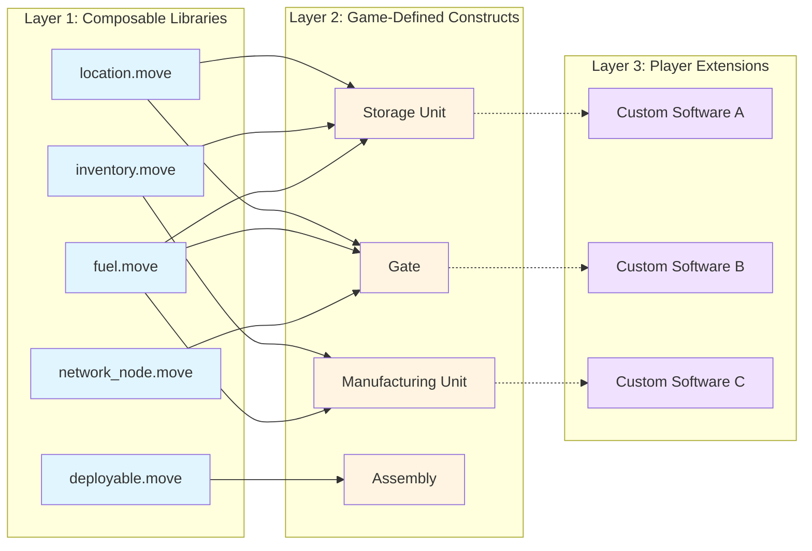

# World Contracts Architecture Decision Record (ADR)

## Context
The Frontier world contracts need to support a complex game environment with structures that can be composed, extended, and modified by both the core game and third-party builders. The architecture must balance flexibility with security while preserving player privacy in a transparent blockchain environment.

## Motivation
Some of the major motivation behind the design decisions are: 

### 1. Composability
Contracts should be structured as logical modules that promote code reusability without circular dependencies. This enables building complex game entities from simple, well-tested components.

### 2. Extensibility
Base modules should support the creation of diverse in-game structures without requiring modifications to the underlying libraries. New constructs can be added by composing existing modules.

### 3. Security
Since Sui smart contracts are publicly accessible and state mutations are permanent, the design must ensure only authorized entities can modify on-chain state. This is critical for preventing unauthorised access and maintaining game integrity.

### 4. Moddability
As a core feature of Frontier, players should be able to extend the behavior of in-game structures they own through custom smart contracts. The world-contracts must provide a secure mechanism for integrating third-party code while maintaining authorization controls.

### 5. Privacy Preservation
While blockchain provides transparency and immutability, certain game mechanics require information asymmetry. The design must support verification of private data (e.g., locations) without revealing the raw data on-chain.

## Decision

We adopt a three-layer architecture that separates core libraries, game-defined constructs, and player extensions. This design leverages Sui's object model and Move's capability system to achieve our goals.

### Layer 1: Composable Libraries

The foundation consists of small, focused modules that implement low-level functionality and data structures per domain. These library modules enforce the "digital physics" of the game world and are designed for maximum reusability.

**Example Library Modules:**
- `location.move` - Spatial positioning and hashed location storage
- `inventory.move` - Item storage and management
- `fuel.move` - Energy/resource consumption mechanics
- `deployable.move` - Base deployable structures
- `network_node.move` - Inter-structure communication

**Design Principle:** Each library is a Move module logically grouped by functionalities. Libraries expose composable functions and can be used without circular dependencies.

**Example Compositions:**
- **Storage Unit** = `inventory` + `location` + `fuel`
- **Gate** = `location` + `fuel` + `network_node`
- **Manufacturing Unit** = `inventory` + `fuel`
- **Basic Assembly** = `assembly` only

**Access Control:** Library modules are currently restricted to Frontier-designed constructs and not directly exposed to third-party builders.

### Layer 2: Game-Defined Constructs

Constructs are the actual in-game entities (storage units, gates, manufacturing facilities) that players interact with. Each construct is implemented as a distinct module that uses underlying composable libraries.

**Construct Implementation:**
- Each construct is a Sui [shared object](https://docs.sui.io/concepts/object-ownership/shared) to enable concurrent access by both game and players
- Constructs expose entry functions that define their behavior
- State mutations are protected by [Move capabilities](https://docs.sui.io/concepts/sui-move-concepts/conventions#access-control) to enforce authorization
- Constructs maintain an allowlist of registered software types for extensibility

**Security Model:** While shared objects allow concurrent access, all mutation operations require proper authorization through capability patterns, preventing unauthorized state changes.

### Layer 3: Player Extensions (Moddability)

Players can extend a construct behavior by deploying custom smart contract packages that register with existing constructs through a `typed authentication witness` pattern. This is a powerful combination of witness / type-based capability pattern in Move. 

**Authentication Mechanism:**
The construct maintains an allowlist of `TypeName` entries. A third-party "software" package registers its own witness type by adding its `TypeName` to this list. Since only the defining module can create instances of its witness type, only that software can call the construct's authenticated entry points.

**Flow:**
- There is a module per construct (ie storage_unit.move, gate.move, etc)
- The module exposes functions to interact with the construct. 
- The owner of a construct can dynamically register a type that is accepted as authentication to call the constructs methods. 

**Example Flow:**
```move
module world::construct {
// Construct maintains allowlist of registered software types
    public struct Construct has key {
        id: UID,
        allowed_software: vector<TypeName>,
        // ... other fields
    }

    public fun perform_op<Auth: drop>(construct: &mut Construct, _auth: Auth) {
        // Verify Auth type is registered in allowed_software
        // ... business logic
    }
}

// Builder's custom software package defines a witness type
module builder::custom_software {
    public struct Auth has drop {} // Witness type
    
    // Only this module can create Auth
    public entry fun swap_items(construct: &mut world::construct::Construct) { 
        world::construct::perform_op(construct, Auth {})
    }
}

// Owner registers the software type
construct::register_software<builder::custom_software::Auth>(construct, auth_cap);

// Now players can call the custom software's entry points
builder::custom_software::swap_items(construct);
```

**Key Benefits:**
- **Type-based authorization:** Only the defining module can create instances of its witness type
- **Dynamic registration:** Software can be added/removed without redeploying constructs
- **Custom side effects:** Builders can add custom logic while constructs enforce authorization by type identity

This pattern is inspired by [Move's typed authorization approach](https://gist.github.com/damirka/eb83f71246c04fd9f511e4ffa7dfb252) shared by the Mysten Labs team.


### Privacy Through Location Obfuscation

To support game mechanics requiring information asymmetry while maintaining on-chain verification:

**Hashed Locations:**
- All on-chain locations are stored as cryptographic hashes rather than cleartext coordinates
- This enables on-chain storage of spatial entities (turrets, gates, sensors, rifts) without revealing their exact positions


**Proximity Verification:**
- Interactions between entities require proving they are in the same location or within proximity range
- **Current implementation:** Signature from a trusted game server validates proximity claims
- **Future implementation:** Zero-knowledge proofs will allow any party with cleartext locations to generate proximity proofs without revealing the actual coordinates

**Example Use Case:** Transferring items between two inventories requires proof that both inventories are at the same or adjacent locations.

### Architecture Diagram



### Folder Structure

```text
world-contracts/
│
├── world/                          
│   ├── sources/
│   │   ├── constructs/             # Game defined constructs
│   │   │   ├── gate.move
│   │   │   └── storage_unit.move
│   │   └── libraries/              # Composable move modules
│   │       ├── deployable.move
│   │       ├── fuel.move
│   │       ├── inventory.move
│   │       ├── location.move
│   │       └── network_node.move
│   ├── tests/
│   │   └── world_tests.move
│   ├── Move.toml
│   ├── Move.lock
└── readme.md

builder-package/                # Custom packages by builders
│
├── sources/
│   └── gate.move
├── tests/
│   └── gate_tests.move
├── Move.toml
├── Move.lock
└── readme.md
```

---

## Consequences

### What becomes easier : 

- With obfuscated on-chain locations, the previous workaround of using view functions to trigger gates and turrets is no longer necessary
- Privacy-preserving location hashing protects sensitive spatial data

### What will be more difficult:

- Users submitting transactions that involve location verification must provide valid proofs (currently signatures, eventually ZK proofs)
- Building transactions for dynamically-extended constructs requires additional PTB construction logic to explore 3rd party packages
- Third-party developers need to understand type-based authorization to extend constructs


### Trade Offs : 
- Using shared objects means a malicious actor could attempt to slow down operations by repeatedly accessing shared objects (transaction contention)
- Mitigation: This will be addressed when Sui's owned object optimizations become available for this use case, or through application-level rate limiting


## Alternatives Considered

### Alternative 1: Separate packages per layer
Implementing each layer as separate Move packages with deployed address dependencies.

**Rejected:** Adds deployment complexity, requires package upgrades when addresses change, and complicates local development.

### Alternative 2: Address-owned objects
Using owned objects with explicit transfers between game and players.

**Rejected:** While address owned objects are more efficient for single-owner scenarios, the game cannot modify the object state.

### Alternative 3: On-chain location oracle
Exposing cleartext locations on-chain via oracle service for builder access and enables more use-cases.

**Rejected:** Eliminates strategic gameplay requiring privacy (hidden bases, ambushes), increases storage costs, and creates oracle dependency. 

### Alternative 4: Capability objects for authorization
Using transferable capability objects instead of type-based witness pattern.

**Rejected:** Type witness pattern provides better security and elegant design. 